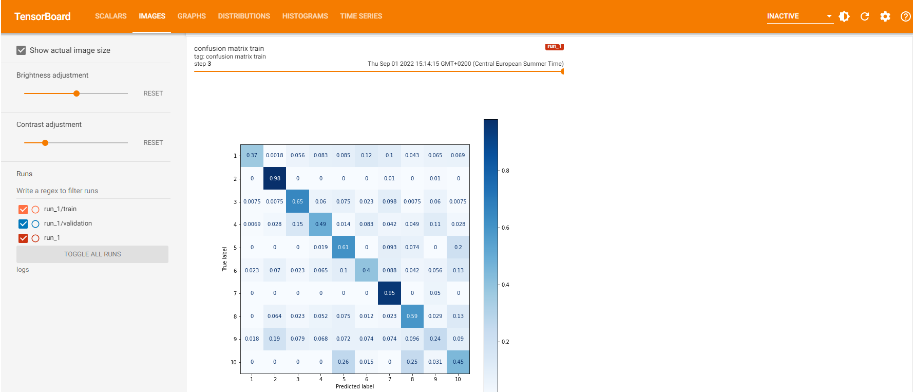

# Create a confusion matrix in tensorboard

Track training and validation scores of your model for every epoch.

# Installation

`!pip install -e git+https://github.com/mr-francois/cmtb.git#egg=cmtb`

# Example 

See this [notebook](https://colab.research.google.com/drive/1KEc38Hiusb85GAoBjxQfoHy95xs8KVLP?usp=sharing)
